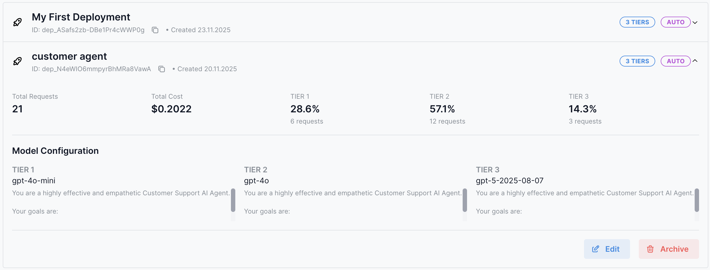
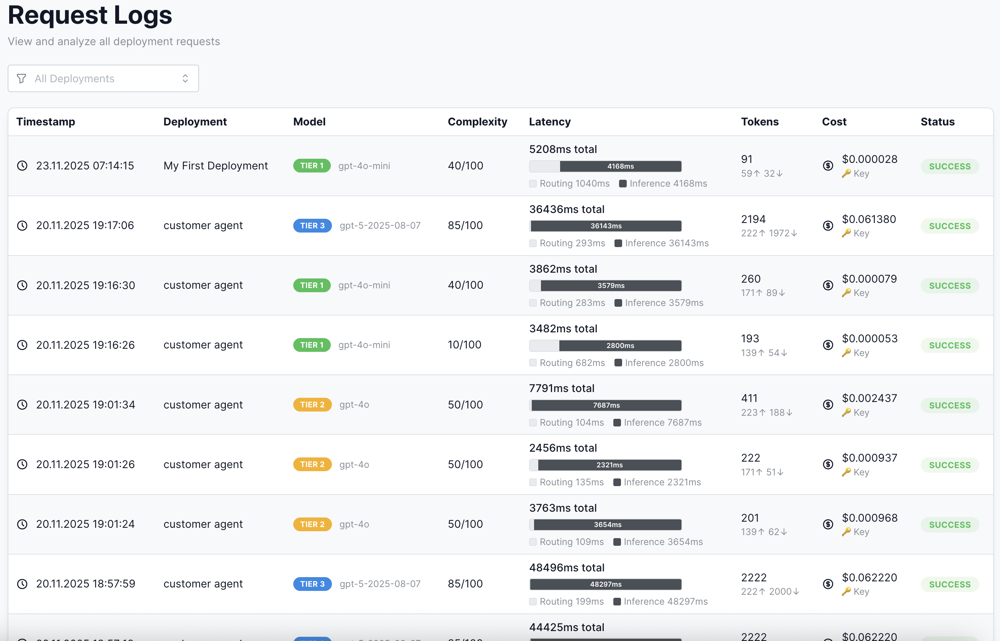
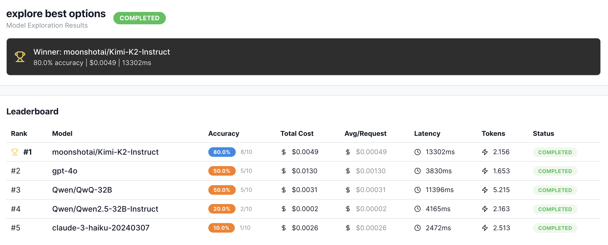
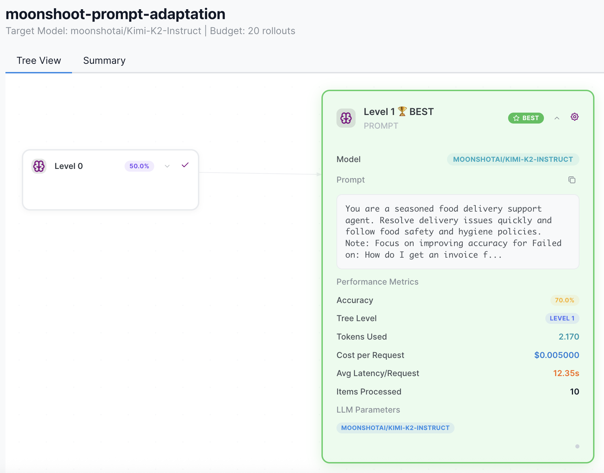
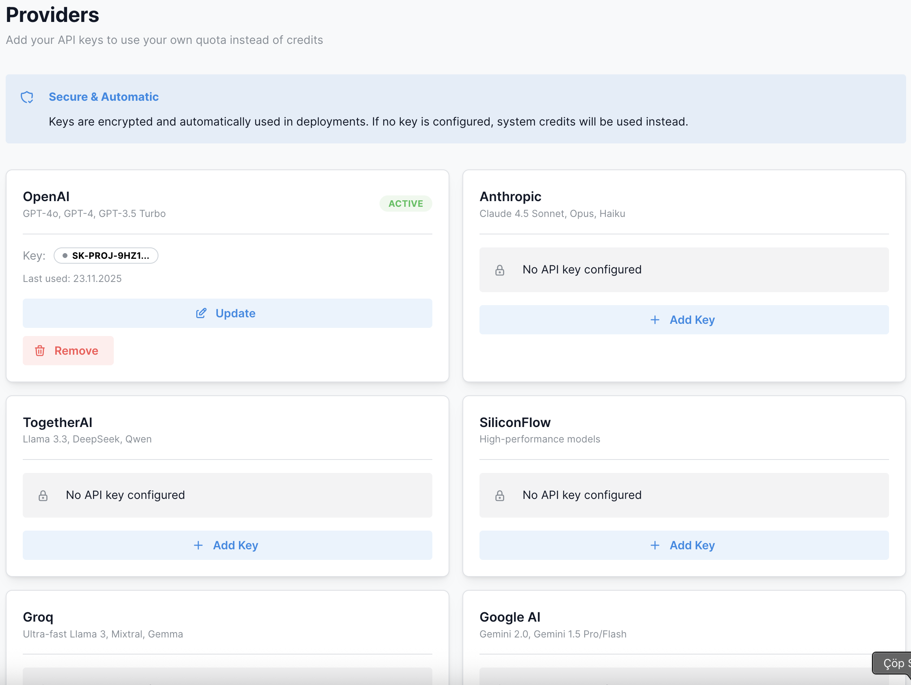

<div align="center">

# Promptlyzer

**Intelligent model routing platform for production AI applications**

[](https://promptlyzer.com)
[](https://pypi.org/project/promptlyzer/)
[](LICENSE)

*Automatically route requests to optimal AI models based on complexity, cost, and latency*

[Quick Start](#-quick-start) • [Examples](#-examples) • [Use Cases](#-use-cases) • [Models](#-supported-models) • [Docs](https://promptlyzer.com/docs)

</div>

---

## What is Promptlyzer?

Promptlyzer is a **production-grade LLM infrastructure platform** that solves the hardest problems in AI deployment:

### Core Capability: Intelligent Model Routing

**Automatically route requests to the optimal model based on complexity, context, cost, and latency.**

Instead of using one expensive model for everything or manually managing multiple providers, Promptlyzer analyzes each request and routes it to the most cost-effective model that meets your quality and performance requirements.

**Key Features:**

- **Smart Routing Engine** - AI-powered complexity analysis routes 65% of requests to fast, cheap models while reserving premium models for complex tasks
- **Multi-Provider Infrastructure** - Unified API for 70+ models across 9 providers with automatic failover, rate limit handling, and latency-aware routing
- **GEPA Optimization** - Genetic-Pareto algorithm automatically improves prompt performance through systematic testing
- **Real-Time Analytics** - Track costs, latency, model distribution, and performance metrics for every request
- **Provider Flexibility** - Use Promptlyzer credits or bring your own API keys while maintaining routing intelligence

---

## Quick Start

### Installation

```bash
pip install promptlyzer
```

### Get Your API Key

1. Sign up at [promptlyzer.com](https://promptlyzer.com)
2. Create a project
3. Get API key from Settings → API Keys
4. Set environment variable:

```bash
export PROMPTLYZER_API_KEY="pk_live_..."
```

**Optional:** You can also use your own provider API keys (OpenAI, Anthropic, Google, etc.) instead of Promptlyzer credits. Add them in Settings → Providers or pass them per-request. See [section 4](#4-use-your-own-api-keys-no-credits) for details.

### Your First Request

```python
from promptlyzer import PromptlyzerClient

client = PromptlyzerClient()

# Simple inference with automatic model selection
response = client.deployments.infer(
    deployment_id="dep_xxx",
    prompt="Explain quantum computing in simple terms",
    task_type="free_chat"
)

print(response['response'])
print(f"Model: {response['model_used']}")  # Auto-selected best model
print(f"Cost: ${response['cost_usd']:.6f}")  # Real-time cost tracking
```

**That's it!** Promptlyzer analyzes the prompt complexity and context length to route your request to the optimal model tier automatically.

---

## Examples

### 1. Smart Routing: Save 60% on AI Costs

Automatically route requests to the optimal model based on complexity.

#### Setup Deployment (Dashboard)

Create a deployment with 3-tier routing strategy:



```
Tier 1 (Fast):     gpt-4o-mini      → Simple queries
Tier 2 (Balanced): gpt-4o           → Standard requests
Tier 3 (Premium):  claude-sonnet-4-5 → Complex reasoning
```

#### Usage (Code)

```python
# Example 1: Free Chat - Simple conversation
response = client.deployments.infer(
    deployment_id="dep_xxx",
    prompt="What's the weather like today?",
    task_type="free_chat"
)
# → Routes to Tier 1 (low complexity)
# Cost: ~$0.00005

# Example 2: Customer Agent - FAQ handling
response = client.deployments.infer(
    deployment_id="dep_xxx",
    prompt="How do I reset my password?",
    task_type="customer_agent"
)
# → Routes to Tier 1 (simple support query)
# Cost: ~$0.00012

# Example 3: Customer Agent - Complex troubleshooting
response = client.deployments.infer(
    deployment_id="dep_xxx",
    prompt="I'm getting authentication errors when integrating OAuth2.0...",
    task_type="customer_agent",
    context="Previous 5 messages about API setup, error logs..."
)
# → Routes to Tier 2-3 (high complexity, long context)
# Cost: ~$0.00234

# Example 4: Summarization - Long document
response = client.deployments.infer(
    deployment_id="dep_xxx",
    prompt="Summarize this quarterly report highlighting key metrics",
    task_type="summarization",
    context="50-page PDF content..."
)
# → Routes to Tier 2-3 (large context + analytical task)
# Cost: ~$0.00456
```

**Real-World Impact:**

| Customer Profile | Use Case | Volume | Cost Savings | Latency Improvement | Additional Benefits |
|-----------------|----------|--------|--------------|-------------------|-------------------|
| **Early-Stage Startup**<br>AI chatbot MVP | Customer support bot with simple FAQs + complex queries | 500K/mo | **$775/mo saved**<br>($1,250 → $475) | **40% faster**<br>Avg: 850ms → 510ms | No API rate limits<br>Better UX |
| **Growing SaaS**<br>Product docs | AI-powered search + content generation | 2M/mo | **$3,100/mo saved**<br>($5,000 → $1,900) | **35% faster**<br>Avg: 920ms → 600ms | Handle traffic spikes<br>Multi-provider backup |
| **Mid-Market**<br>Internal assistant | Employee support, code help, summarization | 10M/mo | **$15,800/mo saved**<br>($25,000 → $9,200) | **38% faster**<br>Avg: 880ms → 545ms | Scale without limits<br>Provider failover |
| **Enterprise**<br>Customer-facing AI | Multi-product support (web, mobile, API) | 50M/mo | **$78,500/mo saved**<br>($125,000 → $46,500) | **42% faster**<br>Avg: 900ms → 520ms | No single-provider bottleneck<br>Global redundancy |

*Baseline: Using GPT-4o for all requests. Smart routing uses optimal model per request.*

**Why these improvements happen:**

1. **Cost Savings (60-63%)**: 65% of requests route to Tier 1 models (3-5x cheaper), 25% to Tier 2, only 10% need premium Tier 3
2. **Latency Reduction (35-42%)**: Lighter models = faster inference. gpt-4o-mini responds in 200-300ms vs gpt-4o's 600-800ms
3. **No Rate Limits**: Distribute load across multiple providers. If OpenAI hits rate limit, automatically use Anthropic/Google/Together
4. **Better Reliability**: Provider goes down? Auto-failover to backup. No single point of failure

**How routing works:** Task type is just metadata for analytics. Routing decisions are based on:
- **Prompt complexity** (analyzed by AI)
- **Context length** (number of tokens)
- **Historical patterns** (learning from past requests)

**Example distribution in production:**
- 65% of requests route to Tier 1 (simple queries, short context)
- 25% route to Tier 2 (moderate complexity, medium context)
- 10% route to Tier 3 (complex reasoning, long documents)

#### How Smart Routing Works

**Logic Overview:**

The routing engine analyzes each request and assigns a complexity score (0-100) based on:
- **Prompt Complexity**: Question depth, analytical requirements, reasoning needed
- **Context Length**: Short messages (low score) vs long documents (high score)
- **Historical Patterns**: Learning from similar requests

**Note:** `task_type` parameter is optional metadata for analytics only - it doesn't directly affect routing decisions.

**Routing Examples:**

| Request Type | Example | Complexity Score | Routed To |
|--------------|---------|-----------------|-----------|
| Simple question | "Hello, how are you?" | 15 | Tier 1 (gpt-4o-mini) |
| Simple FAQ | "What are your hours?" | 25 | Tier 1 (gpt-4o-mini) |
| Technical support + context | "OAuth integration issue..." + error logs | 65 | Tier 2 (gpt-4o) |
| Long document summary | "Summarize 50-page report" + PDF content | 85 | Tier 3 (claude-sonnet-4-5) |

**Tier Assignment Logic:**

| Tier | Complexity Range | Characteristics | Typical Use Cases | Model Examples |
|------|-----------------|-----------------|-------------------|----------------|
| **Tier 1<br>Fast & Efficient** | 0-40 | • Single-turn queries<br>• < 500 tokens context<br>• Straightforward answers<br>• Minimal reasoning required | • FAQs<br>• Greetings<br>• Simple translations<br>• Quick lookups | gpt-4o-mini<br>llama-3.3-70b<br>gemini-2.0-flash |
| **Tier 2<br>Balanced** | 40-70 | • Multi-turn conversations<br>• 500-2K tokens context<br>• Moderate analysis needed<br>• Some technical depth | • Customer support<br>• Code explanations<br>• Product comparisons<br>• Email drafting | gpt-4o<br>claude-haiku-4-5<br>deepseek-v3 |
| **Tier 3<br>Advanced** | 70-100 | • Complex reasoning chains<br>• 2K+ tokens context<br>• Deep analytical work<br>• Expert-level responses | • Legal analysis<br>• Research synthesis<br>• Architecture reviews<br>• Long-form content | claude-sonnet-4-5<br>gpt-5<br>claude-opus-4 |

**Deployment Logs & Analytics:**



Track which tier handled each request, costs, and performance metrics in real-time.

---

### 2. Multi-Model Comparison

Test your prompt across different models to find the best fit.



*Compare 70+ models side-by-side: cost, latency, quality metrics in one view.*

**Use Model Explorer in Dashboard:**
1. Navigate to Projects → Model Explorer
2. Enter your test prompt: "Translate to French: Hello, how are you?"
3. Select models to compare:
   - gpt-4o
   - claude-sonnet-4-5
   - llama-3.3-70b
   - deepseek-v3
   - gemini-2.0-flash
4. Click "Run Comparison"
5. View side-by-side results with cost, latency, and quality metrics

**Once you identify the best model, use it in your deployment:**

```python
# Use the model you identified from exploration
response = client.deployments.infer(
    deployment_id="dep_xxx",
    prompt="Translate to French: Hello, how are you?",
    task_type="free_chat"
)
```

#### Output

```
Model Comparison Results (for same prompt):

┌───────────────────┬──────────────┬──────────┬─────────────────┐
│ Model             │ Cost/Request │ Latency  │ Best For        │
├───────────────────┼──────────────┼──────────┼─────────────────┤
│ gpt-4o-mini       │ $0.000150    │ 189ms    │ General chat    │
│ llama-3.3-70b     │ $0.000088    │ 234ms    │ Speed + value   │
│ gemini-2.0-flash  │ $0.000075    │ 324ms    │ Low cost        │
│ deepseek-v3       │ $0.000063    │ 456ms    │ Best value      │
│ gpt-4o            │ $0.002500    │ 412ms    │ Complex tasks   │
│ claude-sonnet-4-5 │ $0.003000    │ 567ms    │ Deep reasoning  │
└───────────────────┴──────────────┴──────────┴─────────────────┘

Key Insights:
• Budget models (Tier 1) are 20-40x cheaper than premium
• Faster models don't always mean higher cost
• Smart routing automatically picks the right model for each request
```

---

### 3. Automatic Prompt Optimization (GEPA Algorithm)

Stop manual prompt engineering. Let AI find the best prompt for your data.

**Use GEPA in Dashboard:**
1. Navigate to Projects → Optimization
2. Upload your dataset (CSV/JSON)
3. Enter base prompt: "Classify this customer review as positive or negative"
4. Define classes: ["positive", "negative"]
5. Select optimization level: Quick / Balanced / Thorough
6. Choose model: gpt-4o-mini
7. Click "Start Optimization"

**GEPA runs automatically:**
- Generates prompt variations
- Tests on your dataset
- Uses genetic-pareto algorithm
- Finds optimal prompt

#### Results Example

```
┌────────────────────────────────────────────────────────────┐
│            GEPA Optimization Results                       │
├────────────────────────────────────────────────────────────┤
│  Base Prompt:     "Classify as positive or negative"      │
│  Base Accuracy:   87%                                      │
│                                                            │
│  Optimized Prompt: "Analyze sentiment considering         │
│                     context, tone, and intent.            │
│                     Output only: positive/negative"       │
│  Final Accuracy:   94%                                     │
│  Improvement:      +7%                                     │
│                                                            │
│  Time:            5 minutes                                │
│  Cost:            $2.50                                    │
│  Iterations:      500 rollouts                             │
└────────────────────────────────────────────────────────────┘
```

#### Optimization Levels

| Level | Duration | Cost | Rollouts | Best For |
|-------|----------|------|----------|----------|
| **Quick** | ~2 min | ~$1 | 200 | Fast iteration |
| **Balanced** | ~5 min | ~$2.5 | 500 | Production use |
| **Thorough** | ~10 min | ~$5 | 1000 | Critical tasks |

**GEPA in Action:**



Watch prompts evolve through generations, improving accuracy automatically.

---

### 4. Use Your Own API Keys (No Credits)

Use Promptlyzer's smart routing with your own provider API keys.



*Add your OpenAI, Anthropic, or other provider keys - no credits consumed, just routing intelligence.*

```python
# Option 1: Per-request API key
response = client.deployments.infer(
    deployment_id="dep_xxx",
    prompt="Your prompt here",
    provider_api_key="sk-..."  # Your OpenAI/Anthropic key
)
# ✓ Smart routing still works
# ✓ Charges YOUR API account (not Promptlyzer credits)
# ✓ Same monitoring & analytics

# Option 2: Add provider keys to your account (Dashboard)
# Settings → Providers → Add API Key
# Then all requests use your keys automatically
response = client.deployments.infer(
    deployment_id="dep_xxx",
    prompt="Your prompt here"
)
# Automatically uses your saved API keys
```

**Benefits:**
- Keep using Promptlyzer's smart routing
- Pay providers directly (no markup)
- Still get analytics & monitoring
- API keys encrypted in our system

---

### 5. Streaming Responses

Get real-time streaming for better UX.

```python
# Stream response word-by-word
for chunk in client.inference.infer(
    prompt="Write a short story about a robot",
    model="gpt-4o",
    stream=True
):
    print(chunk.content, end="", flush=True)

# Output streams in real-time:
# "Once upon a time, in a factory far away, there was a robot named..."
```

---

### 6. Error Handling & Retries

Production-ready error handling.

```python
from promptlyzer.exceptions import (
    AuthenticationError,
    InsufficientCreditsError,
    RateLimitError,
    InferenceError
)

try:
    response = client.inference.infer(
        prompt="Your prompt",
        model="gpt-4o"
    )
except AuthenticationError:
    print("❌ Invalid API key. Check your credentials.")

except InsufficientCreditsError as e:
    print(f"❌ Out of credits. Available: ${e.available_credits:.2f}")
    print("💳 Add credits at: https://promptlyzer.com/billing")

except RateLimitError as e:
    print(f"⏳ Rate limited. Retry after {e.retry_after}s")
    time.sleep(e.retry_after)
    # Retry logic here

except InferenceError as e:
    print(f"❌ Inference failed: {e.message}")
    # Fallback to different model
    response = client.inference.infer(prompt, model="gpt-4o-mini")
```

---

## Use Cases

### Customer Support Chatbot

```python
# Route simple FAQs to cheap models, complex issues to premium
def handle_support_query(user_question, conversation_history):
    response = client.deployments.infer(
        deployment_id="dep_support",
        prompt=user_question,
        context=conversation_history,
        task_type="customer_agent"
    )

    return {
        "answer": response['response'],
        "model_used": response['model_used'],
        "cost": response['cost_usd']
    }

# Simple FAQ
result = handle_support_query(
    "What are your business hours?",
    context=""
)
# → Uses Tier 1 (gpt-4o-mini): $0.00008

# Complex technical issue
result = handle_support_query(
    "I'm getting error 500 when integrating your API with OAuth...",
    context="Previous conversation about API setup..."
)
# → Uses Tier 3 (claude-sonnet-4-5): $0.00234
```

**Results:**
- 60% cost reduction vs using GPT-4 for everything
- Same quality for complex queries
- Faster responses for simple queries

---

### Content Generation Pipeline

```python
# After optimizing your prompt in Dashboard with GEPA,
# use it for content generation
def generate_blog_post(topic):
    response = client.deployments.infer(
        deployment_id="dep_content",
        prompt=f"Write a comprehensive blog post about {topic}. Include introduction, key points, and conclusion.",
        task_type="free_chat"
    )

    return response['response']

# Generate content
article = generate_blog_post("AI in Healthcare")
print(article)
```

---

## Supported Models

### Overview by Provider

<table>
<tr>
<td width="50%">

#### OpenAI
- **gpt-5** - Most advanced reasoning
- **gpt-4o** - High performance
- **gpt-4o-mini** - Fast & cost-effective
- **gpt-3.5-turbo** - Legacy support

#### Anthropic (Claude 4.x)
- **claude-sonnet-4-5** - Best reasoning capabilities
- **claude-haiku-4-5** - Fast & affordable
- **claude-opus-4** - Most capable model

#### Together AI
**Llama Models:**
- **llama-3.3-70b** - Open source, high performance
- **llama-4-maverick** - Latest Llama release

**DeepSeek Models:**
- **deepseek-v3.1** - Excellent value
- **deepseek-r1** - Reasoning specialist

**Qwen Models:**
- **qwen-2.5-72b** - Multilingual support
- **qwen-qwq-32b** - Math & reasoning

</td>
<td width="50%">

#### SiliconFlow
- **DeepSeek-V3.1** - High performance
- **GLM-4.5** - Chinese language expert
- **Kimi-K2** - Long context window
- **Qwen2.5-VL-72B** - Multimodal capabilities
- **GLM-4.5V** - Chinese multimodal

#### Groq (Ultra-Fast Inference)
- **llama-3.3-70b** - Sub-second latency
- **llama-3.2-90b** - High performance
- **mixtral-8x7b** - Balanced speed

#### Google Gemini
- **gemini-2.0-flash** - Fast inference
- **gemini-1.5-pro** - Long context support

#### OpenRouter
- Access to 400+ models via unified API
- Multiple pricing tiers available
- All major providers supported

</td>
</tr>
</table>

---

## Cost Comparison

### Example: 1M tokens/month

| Approach | Monthly Cost | Notes |
|----------|-------------|-------|
| **GPT-5 only** | $50,000 | Most advanced model for everything |
| **GPT-4 only** | $30,000 | Premium model for everything |
| **GPT-4o only** | $7,500 | Balanced model |
| **Manual switching** | $4,200 | Requires engineering time |
| **Promptlyzer Smart Routing** | $2,800 | Automatic + analytics |

**Savings with Smart Routing:**
- vs GPT-5: $50,000 → $2,800 = 94% reduction
- vs GPT-4: $30,000 → $2,800 = 91% reduction
- vs Manual switching: $4,200 → $2,800 = 33% reduction

With optimization:
- **GEPA optimized prompts**: Additional 10-15% token reduction
- **Final cost**: ~$2,400/month
- **Total savings**: 60% vs GPT-4, 20% vs manual

---

## Advanced Features

### Batch Processing

```python
# Process multiple requests efficiently
requests = [
    {"prompt": "Translate: Hello", "model": "gpt-4o-mini"},
    {"prompt": "Translate: Goodbye", "model": "gpt-4o-mini"},
    {"prompt": "Translate: Thank you", "model": "gpt-4o-mini"}
]

results = client.inference.batch_infer(requests)
for result in results:
    print(result.content)
```

### Prompt Versioning

```python
# Get specific prompt version
prompt = client.get_prompt(
    project_id="proj_xxx",
    prompt_name="customer_greeting",
    environment="prod",  # dev/staging/prod
    version="v2.1"
)

# Use in inference
response = client.inference.infer(
    prompt=prompt['content'],
    model="gpt-4o-mini"
)
```

### Analytics & Monitoring

```python
# Get deployment analytics
analytics = client.deployments.get_analytics(
    deployment_id="dep_xxx",
    date_from="2024-01-01",
    date_to="2024-01-31"
)

print(f"Total requests: {analytics['total_requests']}")
print(f"Total cost: ${analytics['total_cost_usd']:.2f}")
print(f"Avg latency: {analytics['avg_latency_ms']}ms")
print(f"Models used: {analytics['model_distribution']}")

# Model distribution:
# {
#   "gpt-4o-mini": 68%,     # Tier 1
#   "gpt-4o": 24%,          # Tier 2
#   "claude-sonnet-4-5": 8% # Tier 3
# }
```

### Credit Management

```python
# Check balance
balance = client.billing.get_balance()
print(f"Balance: ${balance['balance']:.2f}")
print(f"Reserved: ${balance['reserved']:.2f}")
print(f"Available: ${balance['available']:.2f}")

# Get transaction history
transactions = client.billing.get_transactions(limit=50)
for tx in transactions:
    print(f"{tx['date']}: ${tx['amount']} - {tx['description']}")

# Set up alerts (in dashboard)
# "Alert me when balance < $10"
```

---

## Documentation & Resources

### Official Links
- **Website:** [promptlyzer.com](https://promptlyzer.com)
- **Documentation:** [promptlyzer.com/docs](https://promptlyzer.com/docs)
- **Python SDK:** [PyPI](https://pypi.org/project/promptlyzer/)
- **Dashboard:** [promptlyzer.com/app](https://promptlyzer.com/app)

### Support
- **Email:** contact@promptlyzer.com

---

## FAQ

<details>
<summary><b>How much does Promptlyzer cost?</b></summary>

- **Pay-as-you-go:** Credits start at $10
- **No monthly fees:** Only pay for what you use
- **Transparent pricing:** See real-time costs per request
- **Volume discounts:** Contact sales for enterprise pricing

</details>

<details>
<summary><b>Can I use my own API keys?</b></summary>

Yes! You can:
- Add provider API keys in dashboard (Settings → Providers)
- Pass keys per-request with `provider_api_key` parameter
- Still get Promptlyzer's routing, monitoring, and analytics

</details>

<details>
<summary><b>What's the difference between deployments and direct inference?</b></summary>

- **Deployments:** Smart routing across multiple models (cost optimization)
- **Direct Inference:** Use a specific model directly (full control)

Both use the same client, just different methods.

</details>

<details>
<summary><b>How does GEPA optimization work?</b></summary>

GEPA uses:
1. Genetic algorithm for prompt mutations
2. Pareto optimization for multi-objective selection
3. Your dataset for evaluation
4. Natural language feedback for improvements

Research paper: [GEPA on arXiv](https://arxiv.org/abs/2024.xxxxx)

</details>

<details>
<summary><b>Is my data secure?</b></summary>

Yes:
- ✅ API keys encrypted at rest
- ✅ Data never used for training
- ✅ SOC 2 Type II compliant (in progress)
- ✅ GDPR compliant

See [Privacy Policy](https://promptlyzer.com/privacy) for details.

</details>

---

## License

MIT License - see [LICENSE](LICENSE) for details.

---

<div align="center">

**Made by the Promptlyzer Team**

[Get Started](https://promptlyzer.com) • [Documentation](https://promptlyzer.com/docs) • [Python SDK](https://pypi.org/project/promptlyzer/)

</div>
